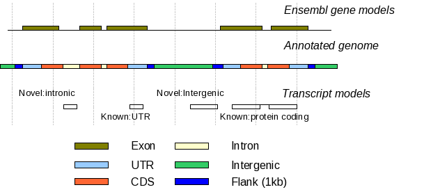
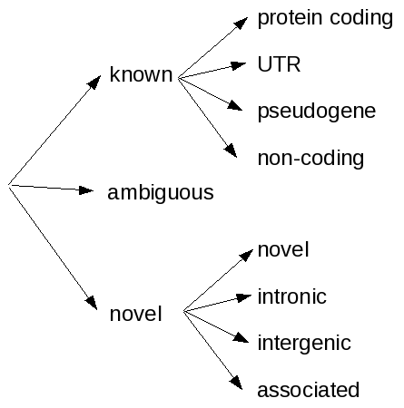
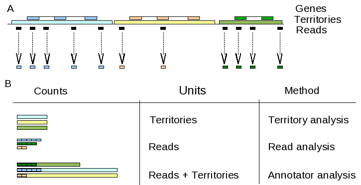
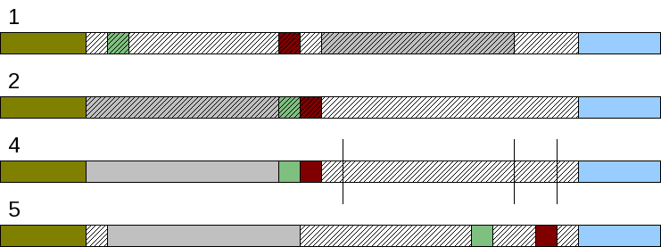
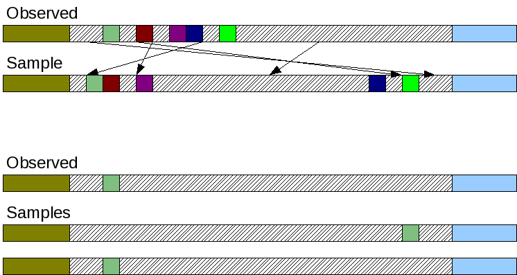
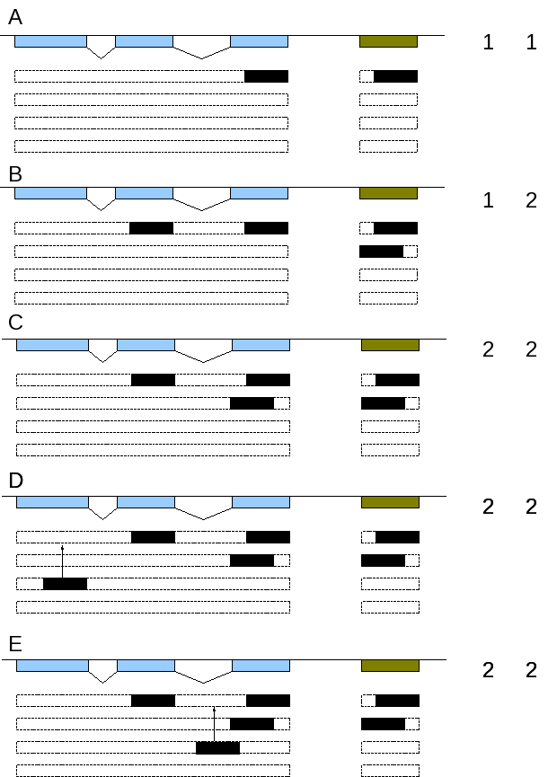

.. _PipelineMethods:

*******
Methods
*******

Annotation of transcript models
===============================

In order to annotate transcript model models, the orang utan genome
assembly was divided into regions using the ENSEMBL gene set (Figure
1). The regions were labeled as exonic, intronic, utr, 5'-flank, 3'
flank and intergenic. The flanking regions were 1kb in size. Intronic
regions had a size of at least 30 bases; regions of less than four
bases were regarded as frameshift insertions and the remaining short
introns were labeled as “novel”. Regions were further sub-divided as
protein coding, pseudogene or non-coding depending on the associated
gene (Figure 2).

Transcript model model model models were assigned to the categories
known, if they were covered with ENSEMBL exonic regions by at least
95% and novel, if they were covered less than 5% by exonic
regions. The remainder were labeled ambiguous. These frequently are
transcript model models overlapping an ENSEMBL gene with a missing
UTR.

The known transcript model models were further labeled as utr, protein
coding, non-protein coding, or pseudogene depending on the associated
ENSEMBL gene annotation. Novel and ambiguous transcript model models
were flagged by their location as intergenic or intronic. The flag
associated is set for transcript model models overlapping the 5' or 3'
1 kb flank of an ENSEMBL gene.

Note that this classification annotates by gene and not by transcript.

   Annotation of transcript models
   
   Ensembl gene model are used to annotate the genome. Transcript model models are then classified according to overlap with particalur genomic regions.

   Hierarchy of classification

   The two level hierarchical annotation of transcript models. Known transcript model models are annotated according to 
   the overlapping ENSEMBL gene model. Novel transcript model models are annotated with respect to the location of the closest ENSEMBL gene model.
   
GO analysis
===========

GO analysis intends do assign function to a set of interest 
by asking if the entities within the set of interest are enriched
or depleted of certain GO functions. Apart from several practical
problems with assigning or inferring GO function, there are also
some theoretical pitfals, for example with set membership.

Some data intended for GO analysis is categorical from the 
outset. With microarray data a gene is usually expressed or not if it
passes a threshold in order detect of genes of a certain function are
expression regulated. Similary, genes either have orthologs or do not,
so again a GO gene list based approach is appropriate to test if certain
genes are better conserved than others.

However with RNASeq data, set membership straight-forward as the following figure illustrates:

   GO set membership is not straight-forward. Panel A shows a genomic
   region with three genes, their assoicated territories and a collection
   of reads in which overlapping reads have already been merged. Panel B
   shows three different analysis scenarios that lead to different results.
   
In territory analysis (top), all three GO terms would have the same counts.
In read analysis (middle), the order of counts would be blue, green, orange,
reflecting the number of reads in each territory. With annotator analysis,
the order would be green, blue, orange, reflecting the relative coverage of
the territory with reads. 
 
Territory analysis
--------------------------

In territory analysis, territories are used in the place of
genes in traditional GO gene list analysis. A territory
is part of the fore-ground set, if there are are a minimum number
of reads associated with it and the background would usually be
the union of all territories. Note that the information flow is from reads 
towards territories. Apart from a rough threshold, the analysis 
ignores the coverage of a territory. 

Such an analysis is appropriate for the analysis of protein coding 
transcription, if the assumption is made that a certain coverage 
of exons by reads is sufficient to gauge expression of the gene 
as a whole.

Using a threshold on statistical read coverage allows to
take expression level into account in a limited manner.

Read analysis
-------------

In read analysis, reads are used in place of genes in
traditional GO gene list analysis. Reads are assigned
GO terms based on their location with a GO territory.
Note that here the information flow is from the territories
to the reads. The background is the union of all reads and
fore-ground sets could be protein coding reads, intronic reads, 
etc.

This is a poor way of counting in almost all set-ups as it 
disregards the size of the fragments and the genes. It introduces 
a bias towards long genes and genes expressed at low level 
(many fragments per gene). 

Annotator analysis
------------------

In annotator analysis, reads are simply genomic segments and
the significance of residue overlap between reads and territories 
is estimated using simulations. The simulations take into account both
the amount and size distribution of both reads and territories. By 
restricting the simulation space towards genomic regions only that are
located in territories (background) and taking as fore-ground a set of
territories assigned a commen GO term, annotator analysis will answer 
the question if transcription is concentrated on these territories.

While annotator analysis is the correct way to assess the association
of genomic features like G+C islands, regions of low recombination, etc.,
there are caveats when using it for GO analysis of transcripts.

For example, protein coding transcription is constrained to exons. A
whole territory will typically be a transcription dessert as only exons are
covered by reads. Thus the association of transcription and territory will be 
grossly underestimated. There is also a subtle bias depending the relative size of exons versus 
introns for protein coding genes. The solution is to use only exons as workspace.
However, this would add a correction for gene length which is usually not desired,
as the common assumption is that genes are transcribed fully, even if only parts 
can be detected due to experimental limitations (see territory analysis)

Annotator analysis is appropriate if the question is: is transcription associated
with certain territories? This should be appropriate for non-coding expression
as we currently observe it. The assumption here is that transcription might
be quite unspecific and noisy or at low level such that full transcripts can not be
assembled. Counting on the territory level would reduce the signal, as almost
all territories might contain an unspecific segment. Counting on the read level 
would introduce a bias due to fragments, a partial transcript split into two parts
will count as two, while the full transcript counts one. 

However, if non-coding transcription were similar to protein coding transcription
(precisely located multi-exonic transcripts with long introns), then the same problems 
would result. In reality, it will be partly like it: not all parts of a territory will
be accessible to transcription, underestimating the strength of transcription in a territory.

Note that the simulation takes into account the length distribution of reads, so
length differences between classes of transcripts should be taken care of. However,
as far as I know, annotator will not take into account the dispersion of transcripts
on the genome. Thus, the same significance will be attached to one territory overlapping 
many transcripts and many territories overlapping one transcript.

Annotator has three types of segments:
1. The segments of interest.
2. The annotations.
3. The workspace.

Note that choosing the correct workspace is critical. The workspace defines the region
of the genome that is accessible for placing simulated reads. The annotations will be
properly truncated to fit into the workspace, so no need to worry about that, but if the
correct workspace for the segments of interest is not carefully chosen, the results 
will be biased. See for example the following figure:

.. figure:: PipelineGOAnnotator.png
   :alt: Choosing the annotator workspace

   Choosing the annotator workspace is critical to answer the
   question asked. Shown are three genes and their associated territories.
   Only two genes have GO annotations, indicated by the color. Observed reads - 
   black boxes delineate the foreground set.
   The workspaces are denoted by grey bars and contain:
   (A) full genome,
   (B) territories, 
   (C) GO territories, 
   (D) intergenic territories, 
   (E) intronic GO territories

(A) WRONG: full genome workspace. If this workspace is chosen, all reads are selected
as fore-ground. Annotator will measure the association of reads with territories, 
and not functional association. Many significant enrichments will be reported, but
these are significant because generally transcription is close to genes - the signal 
of relative enrichment of GO functions will be overwhelmed.

(B) WRONG: territories workspace. If this workspace is chosen, all reads are selected
as fore-ground. Annotator will measure the association of reads with territories 
that have GO annotations. Like in case (A), many significant enrichments will be reported,
but these will not reflect the relative enrichment of GO terms only, but also include
biases in the GO assignment process.

(C) CORRECT: go territories workspace. This workspace only contains gene territories that have
GO terms associated with them. This is the appropriate background to measure the relative
enrichment of GO terms associated with transcription.

(D) CORRECT: intergenic go territories workspace. This is the correct background to measure
functional enrichment of intergenic transcription. If complete territories were used
as workspace, and not only the intergenic parts, the signal-to-noise ratio would
drop and a bias would be introduced against genes with introns.

(E) CORRECT: intronic go territories workspace, see (D).

Note that in all these cases the objective is to detect a functional assocation
of transcription, not if transcription is proximal to genes, intronic, intergenic, etc. 
as such. The latter are different questions and annotator need to be run differently.

Association analysis
====================

Introduction
------------

Association analysis tests whether TLs are significantly closer to protein coding exons
(here: genes) than expected. 

A common approach is to check for enrichment. Enlarge the region around each gene
and test if you find more TLs in such regions then you would expect.

I attempt to use an approach that uses the distance distribution directly. The distance
distribution approach compares the observed distance between TLs and genes with the
one than that is expected by chance.

The accessible positions for a fragment of interest are limited by the size of the
intergenic region, the size of the fragment and other fragments in the area.

.. figure:: PipelineAssociationAnalysis.png
   :alt: Association analysis
 
   Not all of the intergenic space is available for a segment. The intergenic region
   is limited by the brown and blue exons. Possible locations of the green fragment of 
   interest are delineated by the thatched boxes. 
   
If the neutral assumption is that transcripts can be located anywhere, then the probability
of observing a transcript at position x is simply 1 / l with l the size of the accessible
space. The probability of observing a distance x < X is then simply X / l. It is not quite
that simple, though.

The analysis could restrict itself to the distance of the closest gene. This would 
allow other segments to be considered fixed. However, this is unsatisfactory. Consider case
(E) and (F). The distance is the same, but clearly fragments are clustered closer to a gene in (E) than
in (F), but in terms of significance, (F) would give a stronger probability of association as the 
accessible space is larger. Thus, all TL in an intergenic region need to be considered. Then of course the distances
are not independent. The observed data looks like this:

space   size of intergenic space  fragment lengths distances   
=====   ========================  ================ ================
AB      1000                      10,20,10         200,300,400
BC      500                       20               100
CD      10000                     4000             300

The significance of a certain configuration could be assessed by simulations, but
possibly there is an analytical solution?

The two central components are the *sampler* and the *counter*. 

Samplers
--------

Samplers are responsible for re-arranging the configuration of segments within an interval.

Random configuration
~~~~~~~~~~~~~~~~~~~~

The default sampling distributes segments fully randomly within an interval. It works in the following way:

1. Iterate over each intergenic segment and collect all ``nsegs`` TL within it
2. Randomly permutate the order of segments
3. Compute the sum of the length of segments (without introns) ``lsegs`` and the length of the intergenic segment, ``li``
4. Split ``li - lsegs`` into ``nsegs + 1`` parts of random size.
5. Insert the randomly spaced segments between permutated TLs.

 
   Simulation strategy. See text for details.

Note that when counting distances, segments further than the midpoint have
to be ignored, i.e., make sure you get the 3'/5' distinction correct.

Clustering effects
~~~~~~~~~~~~~~~~~~~

Martin suggested that clustering effects might confuse the results and the default sampling
strategy might not be fair. A clustering structure in the data could result from incomplete
assembly due to low coverage transcripts. We see two separate, but close transcripts, which
are fragments of a larger transcript.

 
   Simulation strategy with permuting intergenic distances. Gaps between
   segments are shuffled (shaded boxes), while observed segments remain in-order (top).
   Bottom: for a single segment, this strategy fails.

A sampling strategy that preserves the clustering structure would randomly permutate
the gaps between segments. This would ensure, that the sample would show a similar
clustering structure than the observed data. However, this naive strategy fails if
there is only a single segment within an interval. In this case, the simulation strategy
would only return the observed and the inverted configuration. 

A solution might be in the combination of shuffling with a windowing analysis similar 
to REEF <http://www.biomedcentral.com/1471-2105/7/453>. There, the authors check for
clustered featuers in a genome by computing windows, using a hypergeometric test to
check for enrichment and control the FDR.

Counters
--------

Counters compute the statistic from both the observed and simulated configurations returned
by the *sampler*.

Closest distance
~~~~~~~~~~~~~~~~~

Collect the distance of the closest segment. This signal might not detect genomic contamination. Imagine
terminal exons/UTRs are underpredicted, then there would be strong proximity signal. However,
if there was uniformly distributed genomic contamination as well, the strong proximity signal
would overwhelm the uniform signal.

Probability of transcription
~~~~~~~~~~~~~~~~~~~~~~~~~~~~

A probability of transcription approach computes the probability that a base at distance
X is transcribed. The observed data is simply the histogram over all genes and fragments 
of interest.

The simulated will give a 95% confidence band around the mean of the samples. Thus some sort
of statistical significance can be established. The downside is that this measure is difficult to report.
A possible measure would be the area under the curve between the expected and the observed counts.
For example, the expected probability of transcription within interval (start,end) is 20%, while we
observe 60%, a threefold enrichment.

The problem is that this will not give a single P-Value. If many tests are performed, how can this
be incorporated into multiple testing correction?

All distances
~~~~~~~~~~~~~

The distances of all segments towards the closest gene are counted. This is very similar to
Probability of Transcription, but ignores the lengths of transcripts.

Statistical significance
~~~~~~~~~~~~~~~~~~~~~~~~

I am testing statistical significance using the simulated data. The test statistic is the
median distance/probability of transcription compared to the distribution of this median
in the samples. The simulations will also provide confidence intervals to assess power
and q-values to control the false discovery rate.

Questions
+++++++++

1. Are there normalization issues with respect to the size of the intergenic region?

Other ideas
~~~~~~~~~~~

Density
   Is density or the decay of density a good metric? 

GO analysis
   The problem can be combined with GO analysis by selecting a subset of genes/GO terms.

You could divide each distribution's domain into "bins" (frequency ranges) and use the test that way. A number of non-parametric tests can also be used, e.g. the runs test. See this thread (http://www.physicsforums.com/showthread.php?t=84874&highlight=runs+test).

There are several non-parametric tests for assessing whether 2 samples are from the same distribution. For example, the "runs" test. Suppose the two samples are u_1<...<u_n and v_1<...<v_n. Suppose you "mix" the samples. If the resulting mix looks something like u_1< v_1 < u_2 < u_3 < u_4 < v_2 < v_3 < ... < u_{n-1} < v_{n-1} < v_n < u_n then the chances that they are from the same distribution is greater than if they looked like u_1<...<u_n<v_1<...<v_n. The latter example has a smaller number of runs (only two: first all u's then all v's) than the former (at least seven runs: one u, one v, u's, v's, ..., u's, v's, one u). This and similar tests are usually described in standard probability textbooks like Mood, Graybill and Boes.

1. You could make two variables X(t) = value of the "true" disrtibution (expensive simulation) at point t and Y(t) = value of the alternative dist. (practical simulation) at point t. Then run the regression Y(t) = a + b X(t) for as many t's as you can (or like), then show that the joint hypothesis "(a = 0) AND (b = 1)" is highly statistically significant.

2. Plot X(t) and Y(t) on the same graph. Select a lower bound T0 and an upper bound T1. Let's assume X(T0) = Y(T0) and X(T1) = Y(T1), i.e. both T0 and T1 are crossing points. Divide the interval [T0,T1] into arbitrary subintervals {s(1),...,s(N)}. Define string variable z(i) = "x" if the integral of X(t) - Y(t) > 0 over subinterval s(i); z(i) = "y" otherwise. You'll end up with a string like xxxyyyxyxyx... whose length = N. Now apply the RUNS TEST that I described above.

N.B. The "runs test" addresses the directionality of the error e(t) = X(t) - Y(t); the regression addresses the magnitude of the errors. Technically, the regression minimizes the sum of e(t)2 = sum of [X(t) - Y(t)]2 over all t in the sample. Ideally one should apply both techniques to cover the directionality as well as the magnitude of the errors.

Expression level measurements
=============================

To measure the expression level of known genes, a popular measure to use is
RPKM (reads per kB per million reads): R = 10^9 * C / N * L, where C is the number 
of mappable reads that fall onto the gene’s exons, N is the total number of
mappable reads in the experiment, and L is the sum of the exons in base pairs.

This measure is appropriate for methods providing short-reads with high coverage as
is obtained using Solexa/Illumina sequencing. The situation with 454 sequencing
(longer reads, less coverage) is different....

In an ideal situation, we would sequence each transcript fully and could simply
count the number of transcripts to get the expression level. In practice, we
get only fragments of transcripts (reads), from which we need to infer the number of 
transcripts:

   
   Measuring expression level from 454 reads. Two genes of different lengths are shown on top. 
   Possible transcripts are indicated by dashed boxes and the inferred number of transcripts by
   maximum base coverage are shown on the right.

We make the assumption that there are no artifactual duplicates within our experiment. Artifactual
duplications arise during the sequencing process when the very same fragment gives rise to 
two measurements. 

.. Note::
   We do observe some duplicates that could be artifacts. See the mapping pipeline for more information.

Under this assumption two reads that map to the same region must have come from
two different transcripts. 

The simplest measure is to use the maximum base coverage, i.e., the maximum number of reads aligned to any 
base. This is illustrated in the figure above.

The problem is that in the case of non-overlapping reads we do not know if these
originate from two different transcripts or the same one, see for example cases (D) and (E).
Reads from the third transcript are conceptually placed on the first transcript as we assume
the smallest number of transcripts.

Thus there could be a correction factor for long genes that takes into account undercounting.
The correction factor should also take into account the known biases we observe in sequencing, for example
the 3'->5' biases in coverage. This is akin to defining an effective length of a gene.

.. note::
   Martin has suggested that the above model is wrong if we assume that 
   the population of transcripts that is sequenced is large. If
   lowly expressed genes are present as 1000s of molecules, the actual
   probability of two reads being from the same transcript is low even
   if there are only few reads mapping to a gene.

.. glossary::

   kTkAr
	constraint. The constraint is computed as the ratio between :term:`kT` and :term:`kAR`.
 
   kT 
        substitution rate.
 
   kAR	
   	substitution rate in ancestral repepats. Ancestral repeats in the neighbourhood
	of a transcript are collected and the individual substitution rates are averaged.
	The minimum length of an ancestral repeat to be included is 100.

